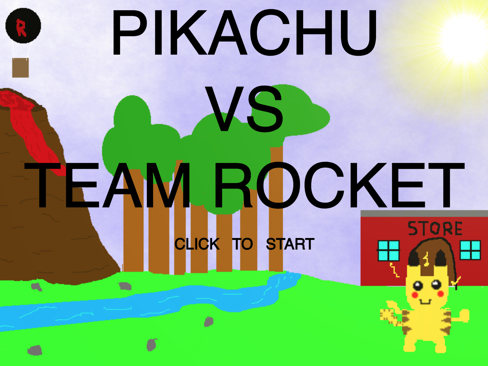
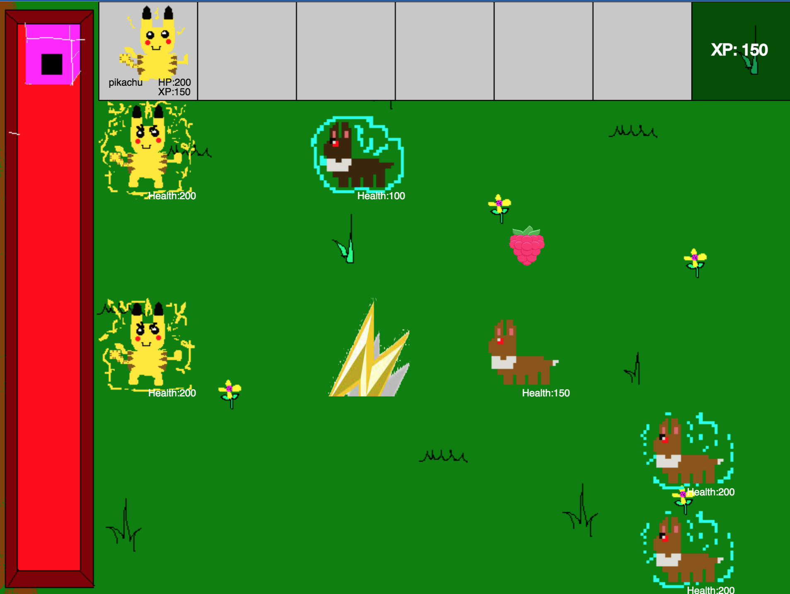
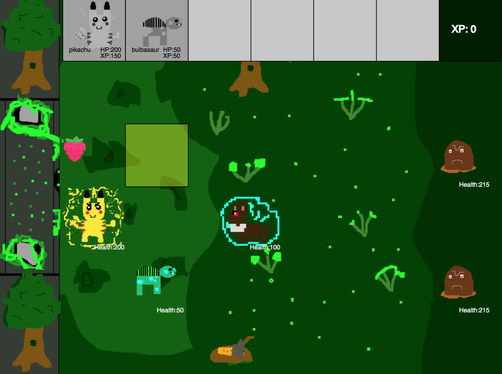
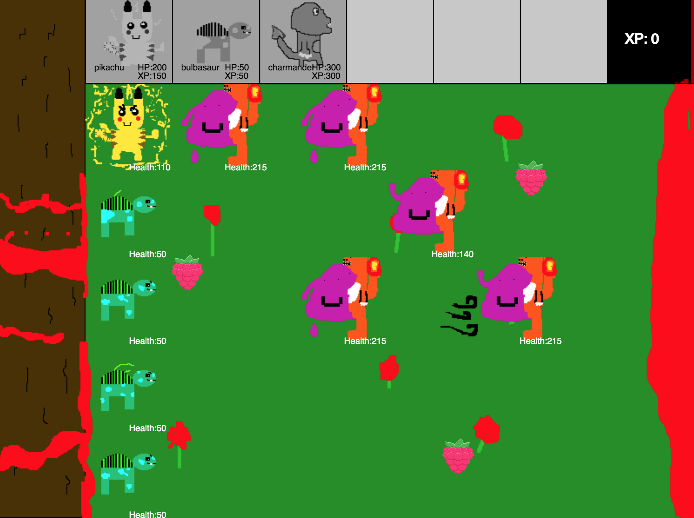
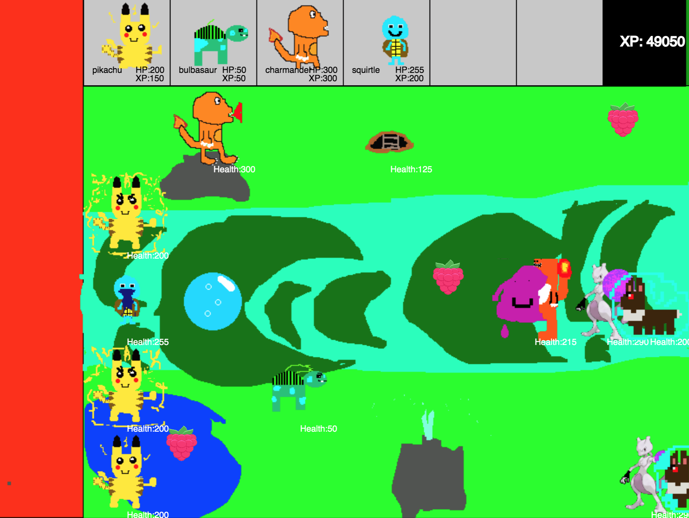
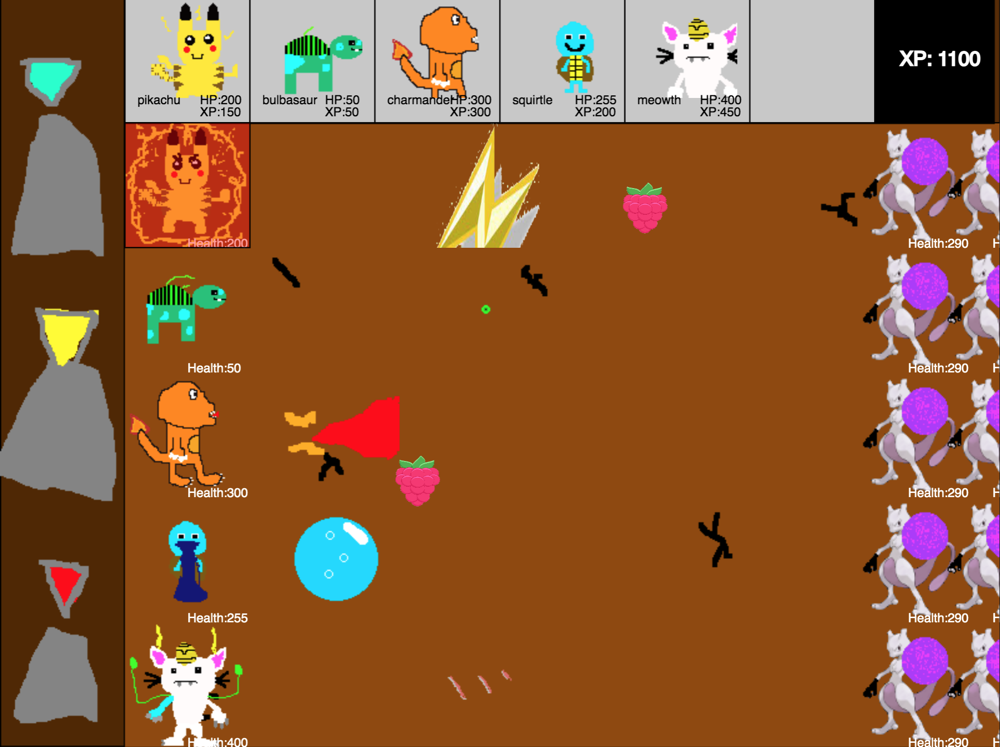
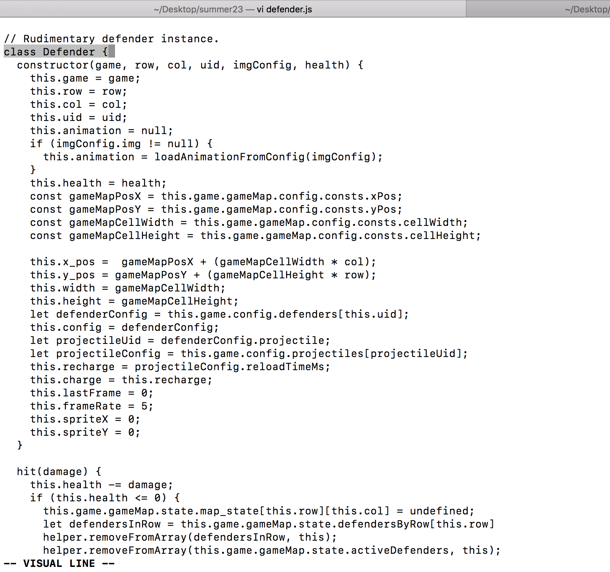
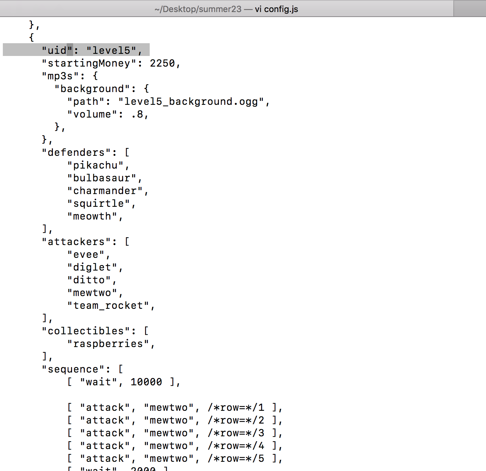
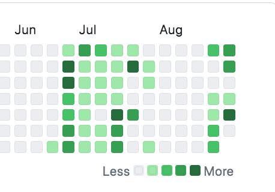

# POKEMON VS TEAM ROCKET

## Overview

This is a Pokemon-themed castle-defender game modeled after "Plants vs.
Zombies".

It consists of 5 levels in which various attackers attack from the right with
the goal of reaching the left side of the screen. The player starts the level
with an amount of XP displayed in the top-right of the screen. The player can
click on falling collectibles to increase their XP. The player spends XP to buy
and place defenders in the way of the attackers. The defenders launch
projectiles of various strengths. The attackers can hit the defender only when
next to them. Defenders and attackers have HP that represents their health.

The game is meant to be played on a device with a touch screen or mouse.

## Play the game

The latest version of the game is hosted at: 

https://s3vans.github.io/summer23/

### [CLICK HERE TO PLAY](https://s3vans.github.io/summer23)

## Keyboard shortcuts / hacks

The game is meant to be played on a device with a touch screen or mouse, but
here are some keyboard shortcuts that might be useful for exploring the game,
especially if you are having trouble beating a level.

Note: These only work when you are in the middle of a level and have no
defenders selected.

```
 +-----+-------------------------------------------------------------+
 | KEY |                          ACTION                             |
 +-----+-------------------------------------------------------------+
 |  p  |  Load previous level.                                       |
 +-----+-------------------------------------------------------------+
 |  n  |  Load next level.                                           |
 +-----+-------------------------------------------------------------+
 |  op |  Make all defender O.P. (Over-Powered)                      |
 +-----+-------------------------------------------------------------+
 |  m  |  Get rich quick.                                            |
 +-----+-------------------------------------------------------------+
 |  0  |  Drop a single collectible.                                 |
 +-----+-------------------------------------------------------------+
 | 1-9 |  Number keys NM => On row N, send attacker M. (rows: 1-5)   |
 +-----+-------------------------------------------------------------+
```

## Screenshots

















## Stats

Roughly...

* ~250 commits over ~2.5 months
* ~2000 lines of questionable code
* ~400 lines of game config
* ~30 animated images
* ~60 sound files
* ~42 days of activity



## Run it on your local computer

To host it on your local computer at https://localhost:8000, run:

```
git clone https://github.com/s3vans/summer23.git
cd summer23

# Start a webserver with either:
python -m SimpleHTTPServer      # python2.7
# OR:
python -m http.server           # python3
```

## Prototype from 2022

We are rewriting the game from scratch after making this prototype in summer
2022 at the beach:

https://editor.p5js.org/sevans/full/y5qZa0vpI

## Credits

**Game design and feature:** 5w1p3r, s3vans

**Coding:** s3vans, 5w1p3r 

**Pixel art and animations:**  5w1p3r

**Debugging and problem solving:** 5w1p3r, s3vans

**Beta testers:** hyph1nn, m0m

**Distractions:** tr1st4n, r00fus

**Inspiration:** PvZ, Pokemon, Nintendo, Zelda, Minecraft, Waynes World

**Resources:** [p5js.org](https://p5js.org),
[thecodingtrain.org](https://thecodingtrain.org)
